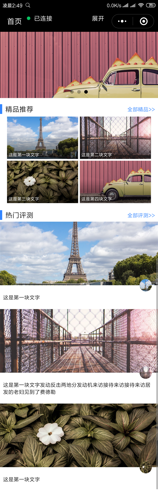

# homePage
小程序首页

## 知识点

##### 文字分布左右两端，上下对齐 ，如上图 
 display: flex;
 justify-content: space-between;
 align-items: center;

##### 文字上下居底对齐
  display: flex;
  flex-direction: column;
  justify-content: flex-end;

完整页面

